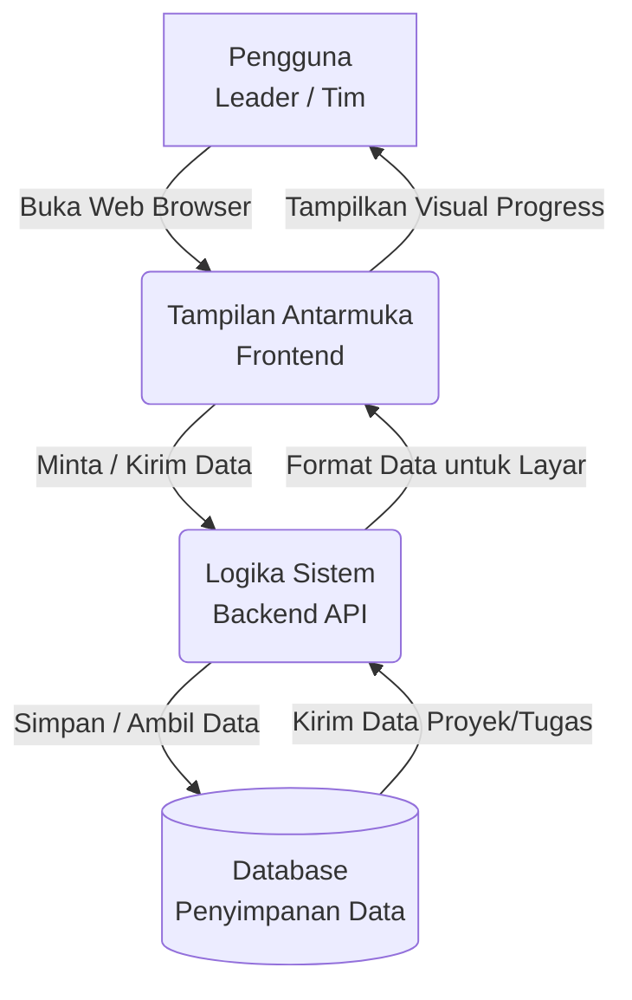
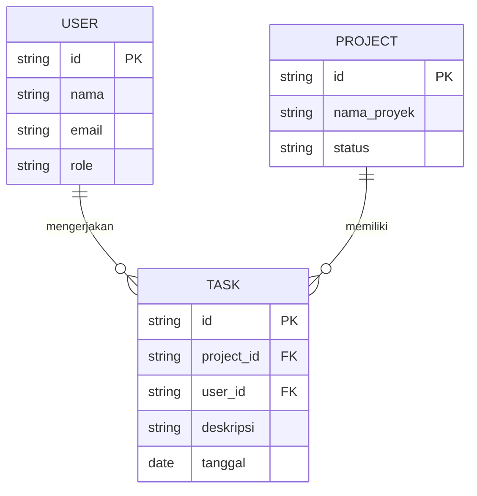
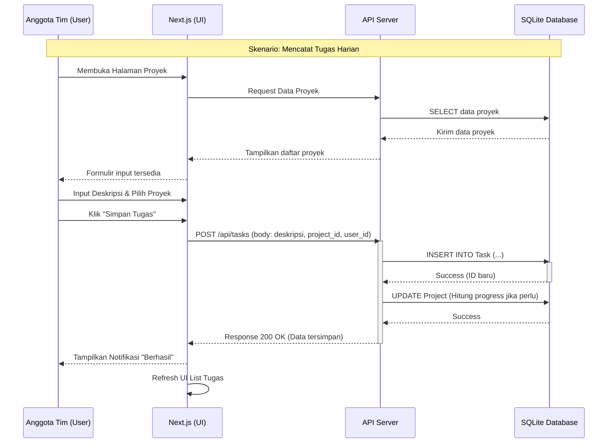

# PRD — Project Requirements Document

## 1. Overview
Saat ini, banyak pemimpin tim (Leader) di startup yang masih menggunakan Microsoft Excel secara manual untuk melacak pekerjaan dan proyek timnya. Cara ini rentan terhadap kesalahan, sulit untuk diperbarui secara *real-time*, dan tidak memberikan gambaran kemajuan (progress) yang jelas. 

Aplikasi Web ini dirancang khusus untuk menyelesaikan masalah tersebut. Tujuan utama aplikasi ini adalah menjadi alat manajemen proyek yang **jauh lebih mudah (user-friendly)** dibandingkan Excel, di mana pengguna bisa langsung melihat daftar proyek, mencatat tugas harian, dan memantau persentase kemajuan pengerjaan dengan cepat.

## 2. Requirements
*   **Aksesibilitas Web:** Aplikasi harus berbasis web sehingga dapat diakses kapan saja dan di mana saja melalui browser tanpa perlu instalasi rumit.
*   **Antarmuka Sederhana (Intuitive UI):** Desain tidak boleh membingungkan. Pengguna yang terbiasa dengan Excel harus merasa transisi ke aplikasi ini sangat mudah dan tidak memerlukan pelatihan khusus.
*   **Peran Pengguna (Role-based):** Sistem harus bisa membedakan antara "Leader" (yang membuat proyek dan melihat progress) dan "Anggota Tim" (yang mengerjakan tugas harian).
*   **Performa Cepat:** Waktu muat halaman untuk melihat laporan harus instan agar tidak mengganggu produktivitas.

## 3. Core Features
*   **Manajemen Proyek (Momen Sukses Pertama):** Fitur bagi Leader untuk membuat daftar proyek baru, mengedit, dan menutup proyek yang sudah selesai.
*   **Jurnal Tugas Harian:** Anggota tim dapat masuk ke aplikasi dan langsung mengetikkan apa tugas atau pekerjaan yang telah mereka selesaikan pada hari itu, lalu menautkannya ke proyek tertentu.
*   **Dasbor Progress (Dashboard):** Layar utama (khususnya untuk Leader) yang secara visual menampilkan "Sejauh mana proyek ini berjalan?" berdasarkan tugas harian yang diselesaikan oleh tim.
*   **Sistem Otorisasi Sederhana:** Login aman memakai email untuk memastikan data proyek startup bersifat rahasia dan hanya bisa diakses oleh tim internal.

## 4. User Flow
Berikut adalah gambaran langkah sederhana bagaimana aplikasi digunakan:
1.  **Login:** Leader dan Anggota Tim masuk ke dalam aplikasi menggunakan email.
2.  **Pembuatan Proyek (Leader):** Leader menekan tombol "Buat Proyek Baru" dan memasukkan nama proyek yang akan dikerjakan.
3.  **Pencatatan Tugas (Anggota Tim):** Anggota tim membuka aplikasi, memilih proyek dari daftar, dan menulis tugas harian yang baru saja diselesaikan.
4.  **Pemantauan (Leader):** Leader membuka menu Dasbor dan langsung melihat *update* terbaru serta persentase kemajuan dari proyek tanpa harus bertanya satu per satu ke anggota tim.

## 5. Architecture
Aplikasi ini akan menggunakan arsitektur modern yang menyatukan bagian tampilan (Frontend) dan logika server (Backend) dalam satu tempat kerja untuk mempercepat pengembangan.

## 6. Database Schema
Untuk menyimpan data, kita membutuhkan tiga tabel utama: Pengguna (User), Proyek (Project), dan Tugas Harian (Task). 

**Detail Tabel:**
1.  **USER (Pengguna):** Menyimpan data orang yang menggunakan aplikasi.
    *   `id` (String) - ID unik pengguna.
    *   `nama` (String) - Nama lengkap.
    *   `email` (String) - Email untuk login.
    *   `role` (String) - Penentu apakah dia 'Leader' atau 'Tim'.
2.  **PROJECT (Proyek):** Menyimpan daftar proyek yang sedang berjalan.
    *   `id` (String) - ID unik proyek.
    *   `nama_proyek` (String) - Judul proyek.
    *   `status` (String) - Status proyek (Contoh: Menunggu, Berjalan, Selesai).
3.  **TASK (Tugas Harian):** Menyimpan log pekerjaan harian tim.
    *   `id` (String) - ID unik tugas.
    *   `project_id` (String) - Mengikat tugas ke proyek mana (Relasi).
    *   `user_id` (String) - Menunjukkan siapa yang mengerjakan (Relasi).
    *   `deskripsi` (String) - Catatan pekerjaan yang dilakukan.
    *   `tanggal` (Date) - Kapan tugas diselesaikan.

**Diagram Relasi Database (ERD):**

## 7. Tech Stack
Untuk membangun aplikasi yang cepat, modern, dan hemat biaya bagi startup, direkomendasikan teknologi berikut (berfokus pada ekosistem JavaScript/TypeScript):

*   **Kerangka Kerja (Framework) Terintegrasi:** **Next.js** (Sangat efisien karena mencakup Frontend dan Backend sekaligus).
*   **Desain & Tampilan (UI/UX):** **Tailwind CSS** dipadukan dengan **shadcn/ui** (Membuat tampilan profesional, bersih, dan modern dengan sangat cepat).
*   **Pengelola Database (ORM):** **Drizzle ORM** (Digunakan agar sistem Backend lebih mudah berbicara dan mengambil data dengan struktur database secara aman).
*   **Penyimpanan Data (Database):** **SQLite** (Sangat ringan, hemat biaya, dan lebih dari cukup untuk menampung teks tugas harian startup di tahap awal).
*   **Keamanan & Akses (Authentication):** **Better Auth** (Sistem login yang praktis dan aman, cocok untuk ekosistem Next.js).
*   **Hosting / Deployment:** **Vercel** (Proses perilisannya otomatis saat kode selesai ditulis, sangat bersahabat untuk Next.js).

## 8. Sequence Diagram
Diagram berikut memvisualisasikan interaksi teknis antara pengguna (Anggota Tim), Sistem (Frontend & Backend), dan Database saat proses pencatatan tugas harian berlangsung.

